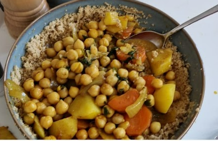

# Moroccan Couscous with Chickpeas

**Tag:** High Protein 💪  

A vegetarian, high-protein and healthy recipe with a Moroccan touch.  

---

## Ingredients

- 1 onion, chopped  
- 1 carrot, chopped  
- 1 potato, chopped  
- 2 garlic cloves, minced  
- 1 can of chickpeas (cooked)  
- Olive oil  

**Spices**:  
- 1 tsp ginger  
- 1 tsp turmeric  
- 1 tsp garlic powder  
- 1 tsp cumin  
- 1/2 tsp cinnamon  

**For the couscous**:  
- 1 cup couscous  
- 1 cup boiling water  
- Olive oil or butter (optional)  

---

## Instructions

1. In a pan, sauté onion, carrot, potato, and garlic with a bit of olive oil until softened.  
2. Add the spices (ginger, turmeric, garlic powder, cumin, cinnamon) and stir well.  
3. Add a little water or broth and let it cook for about **15 minutes**.  
4. Add the cooked chickpeas and simmer for another **10 minutes**.  

**Prepare the couscous separately**:  
1. Lightly toast the couscous in a pan (dry, without oil).  
2. Transfer to a bowl, add **1:1 ratio of boiling water**, cover, and let sit for **5 minutes**.  
3. Fluff with a fork and drizzle with olive oil or butter (optional).  

---

## Serving

Serve the couscous in a bowl and top it with the chickpea–vegetable mix.  

---

## Notes

- This recipe is **vegetarian, healthy, and high in plant protein** thanks to the chickpeas.  
- You can add raisins, dates, or fresh herbs (like cilantro or parsley) for extra flavor.  
